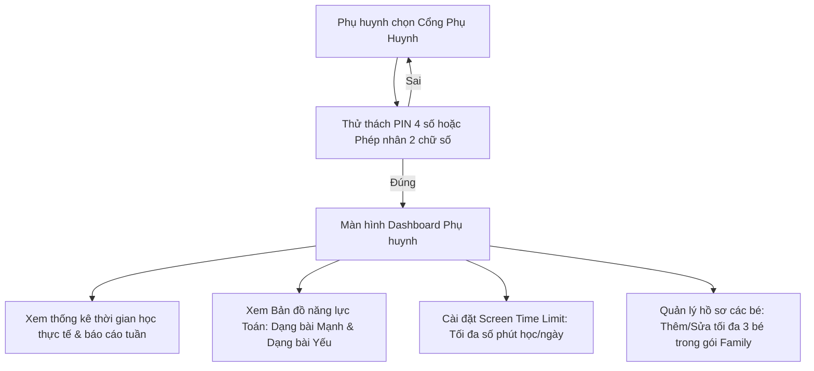
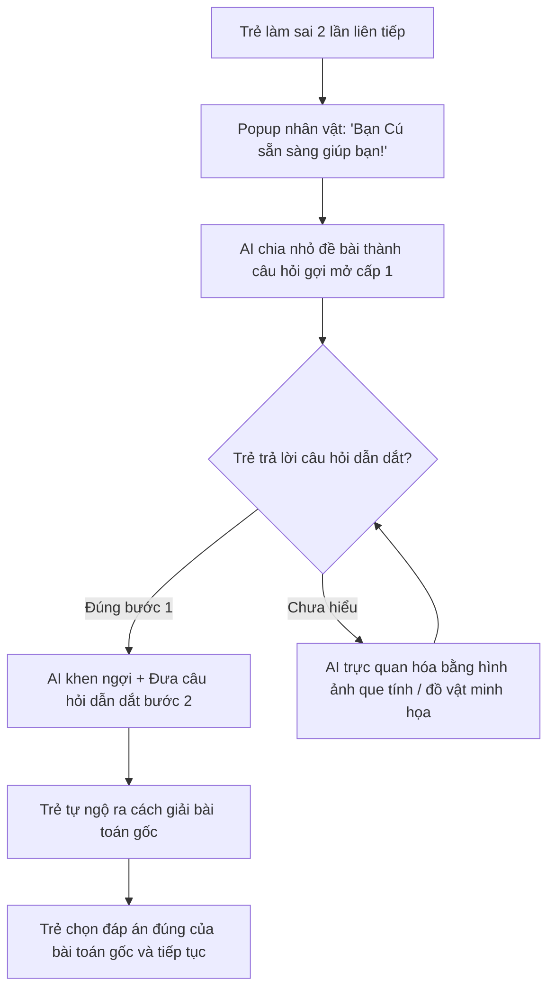

# ỨNG DỤNG HỌC TOÁN CẤP 1 (MATHLINGO) - QUY CHUẨN DỰ ÁN & PRODUCT REQUIREMENTS

Tài liệu quy định toàn bộ yêu cầu chức năng, phi chức năng, quy tắc nghiệp vụ, luồng xử lý và kiến trúc kỹ thuật dành cho dự án **MathLingo**. Toàn bộ mã nguồn và các tính năng phát triển phải tuân thủ nghiêm ngặt các quy tắc dưới đây.

---

## 1. Functional Requirements (Yêu cầu chức năng)

### 1.1. Tài khoản kép (Parent & Kids Profile Management)
- **Cấu trúc tài khoản:** 1 tài khoản Phụ huynh (Parent Account) quản lý độc lập nhiều hồ sơ Học sinh (từ Lớp 1 đến Lớp 5).
- **Mã PIN bảo vệ:** Cổng phụ huynh (Parent Portal) được khóa an toàn, yêu cầu nhập mã PIN 4–6 số hoặc giải phép toán nhân 2 chữ số (Gatekeeper check).
- **Parent Portal:**
  - Theo dõi tiến độ học tập, tổng thời lượng học thực tế (screen time).
  - Bản đồ kỹ năng phân tích trực quan: chuyên đề con nắm vững (Mạnh) và dạng toán thường làm sai (Yếu).
  - Cài đặt thời gian học giới hạn mỗi ngày (Screen time limit: ví dụ 20 phút/ngày).

### 1.2. Learning Engine Toán học trực quan (Visual Math Engine)
- **Bản đồ kho báu (Treasure Map Journey):** Lộ trình học phân nhánh sinh động theo từng khối lớp (Lớp 1 - Lớp 5), mỗi chặng là bài học ngắn gọn 3–5 phút.
- **Dạng bài tập tương tác cao (Interactive Math Mechanics):**
  - **Lớp 1–2:** Kéo thả que tính, đếm hoa quả/đồ vật, ghép nối số lượng và phép cộng/trừ cơ bản trong phạm vi 10, 20, 100.
  - **Lớp 3:** Điền bảng cửu chương tương tác, xoay kim đồng hồ xem giờ/phút, phép nhân/chia có nhớ.
  - **Lớp 4–5:** Thước đo trực quan tính chu vi & diện tích (hình vuông, chữ nhật, tam giác, hình bình hành), phân tích bài toán có lời văn bằng sơ đồ đoạn thẳng tương tác.

### 1.3. Gamification thân thiện với trẻ em (Child-Friendly Gamification)
- **Math Streak:** Chuỗi ngày học liên tục rèn thói quen; tự động tặng "Khiên bảo vệ Streak" (Streak Freeze) khi trẻ học chăm chỉ liên tục 7 ngày.
- **Sao Năng Lượng & Danh hiệu:** Tích lũy sao qua từng bài học để thăng cấp danh hiệu: *Tập sự Toán học* ➔ *Thám tử Toán học* ➔ *Chiến binh Phép tính* ➔ *Nhà Bác học Nhí*.
- **Đấu trường thi đua (Weekly League):** Bảng xếp hạng thi đua tuần nhóm 30 bạn cùng khối lớp, tôn vinh nỗ lực học tập (tính theo XP/sao), không gây áp lực điểm số tiêu cực.
- **Cửa hàng trang phục Cú Toán Học:** Dùng Sao/Kim cương kiếm được từ việc học để đổi mũ, kính, trang phục và phụ kiện cho linh vật Cú Toán Học (Owl Mascot).

### 1.4. Gia sư AI Toán (Socratic Math AI Tutor)
- **Phương pháp Socratic:** Không đưa ra trực tiếp đáp án số, AI hướng dẫn từng bước nhỏ mang tính gợi mở, đặt câu hỏi dẫn dắt để học sinh tự suy nghĩ và tìm ra lời giải.
- **Trợ lý "Hỏi bạn Cú":** Tự động kích hoạt khi học sinh làm sai 2 lần liên tiếp trong một câu hỏi.
- **Adaptive Learning:** Tự động điều chỉnh độ khó và sinh thêm bài tập bổ trợ nhẹ nhàng cho các dạng bài trẻ đang gặp khó khăn.

---

## 2. Non-Functional Requirements (Yêu cầu phi chức năng)

### 2.1. Hiệu năng & Trải nghiệm tương tác (Performance & UX)
- **Chuẩn 60 FPS:** Đảm bảo mượt mà tuyệt đối ở tất cả hoạt cảnh kéo thả (drag & drop), xoay kim đồng hồ và hiệu ứng thưởng sao.
- **Child-Friendly Touch Target:** Kích thước nút bấm và vùng chạm (hit-box) tối thiểu **48x48 dp** (chuẩn khuyến nghị 56x56 dp cho tablet/iPad) phù hợp ngón tay trẻ nhỏ.
- **Ngôn ngữ & Hình ảnh:** Màu sắc tương phản cao, hoạt hình tươi sáng, font chữ bo tròn dễ đọc (Nunito / Quicksand), hạn chế văn bản dài đối với lớp 1–2, hỗ trợ âm thanh phát âm đề bài (Text-to-Speech).

### 2.2. An toàn trẻ em & Tuân thủ pháp lý (COPPA & GDPR-K Compliance)
- **Zero PII for Kids:** Tuyệt đối không thu thập dữ liệu định danh cá nhân của trẻ em (không yêu cầu họ tên thật, CCCD, trường lớp cụ thể, vị trí địa lý).
- **Ad-Free:** 100% không chứa quảng cáo từ bên thứ ba (Third-party ads).
- **Safe Environment:** Không có tính năng chat tự do, không nhắn tin riêng với người lạ; tên hiển thị trên bảng xếp hạng là biệt danh ngẫu nhiên (VD: *Thỏ Thông Thái, Khủng Long Tốc Độ*).

### 2.3. Khả năng học Ngoại tuyến (Offline-First Capability)
- **Tự động Cache:** Hệ thống tự động tải và lưu đệm nội dung các bài học của 2 tuần tiếp theo vào bộ nhớ nội bộ của thiết bị.
- **Đồng bộ hóa (Sync):** Cho phép học sinh hoàn thành bài học khi mất mạng/trên xe; tự động đồng bộ kết quả, sao và streak lên cloud ngay khi có kết nối trở lại.

---

## 3. Business Rules (Quy tắc nghiệp vụ)

| Mã quy tắc | Tên quy tắc | Nội dung chi tiết |
| :--- | :--- | :--- |
| **BR-01** | **Khóa cổng Phụ huynh** | Mọi thao tác chuyển từ màn hình bé sang Cổng Phụ huynh (Parent Portal), thanh toán hoặc cài đặt hệ thống đều bắt buộc phải vượt qua thử thách: Phép tính nhân 2 chữ số (VD: $14 \times 7 = ?$) HOẶC mã PIN 4 số do phụ huynh thiết lập. |
| **BR-02** | **Hạn chót duy trì Streak (21:00)** | Hạn chót tính Streak học tập trong ngày kết thúc lúc **21:00 tối** nhằm xây dựng thói quen đi ngủ trước 22:00 cho trẻ tiểu học. Tặng 01 Khiên bảo vệ miễn phí khi đạt chuỗi 7 ngày liên tiếp. |
| **BR-03** | **Bình Tim & Vườn Luyện Tập** | Trẻ bắt đầu với 5 Tim. Mỗi lần trả lời sai mất 1 Tim. Khi hết Tim: **Tuyệt đối không ép phụ huynh nạp tiền** để mua tim. Trẻ có thể mở "Vườn Luyện Tập" để làm 3 phép tính nhẩm cơ bản không tính điểm phạt nhằm hồi phục Tim và tiếp tục bài học chính. |
| **BR-04** | **Chính sách Gói Gia đình** | Gói tài khoản trả phí gia đình (MathLingo Family / Premium) cho phép dùng chung độc lập cho tối đa **03 hồ sơ trẻ** (3 kids profiles) trên cùng 1 tài khoản phụ huynh quản lý. |

---

## 4. Main Workflows (Quy trình luồng chính)

### Workflow 1: Trải nghiệm học tập của Học sinh (Kid's Learning Flow)
```mermaid
graph TD
    A[Bé chọn bài trên Bản đồ kho báu] --> B{Kiểm tra Tim (> 0?)}
    B -- Hết Tim --> C[Vào Vườn Luyện Tập nhẩm toán hồi Tim]
    C --> B
    B -- Còn Tim --> D[Vào màn hình bài toán tương tác kéo thả]
    D --> E{Trả lời đúng?}
    E -- Đúng --> F[Hiệu ứng âm thanh chúc mừng + Tích lũy Sao Năng Lượng]
    F --> G[Cập nhật chuỗi Streak + Kiểm tra mốc danh hiệu]
    G --> H[Hoàn thành chặng / Mở khóa màn tiếp theo]
    E -- Sai lần 1 --> I[Mất 1 Tim + Hiện gợi ý trực quan bằng que tính/hình vẽ]
    I --> D
    E -- Sai lần 2 --> J[Kích hoạt Workflow 3: Hỏi bạn Cú Socratic AI]
```

### Workflow 2: Quản lý & Giám sát của Phụ huynh (Parent Supervision Flow)


### Workflow 3: Gia sư AI dẫn dắt Socratic (Socratic AI Tutor Flow)


---

## 5. Architectural & Implementation Guidelines (Quy chuẩn kiến trúc phần mềm)

- **Framework:** Flutter (>= 3.47.0) & Dart (>= 3.13.0).
- **Kiến trúc:** Clean Architecture (Feature-First) phân chia rõ 3 tầng:
  - `presentation`: UI Pages, Widgets tương tác cho trẻ em, State Management.
  - `domain`: Entities, Use Cases, Repository Interfaces, Business Rules (BR-01 đến BR-04).
  - `data`: Data Models, Local Storage (Offline Cache), Data Sources.
- **State Management & DI:** BLoC / Cubit hoặc Riverpod với cấu trúc modules rõ ràng.
- **Offline-First:** `sqflite` / `hive` / `shared_preferences` hỗ trợ offline cache trọn vẹn 2 tuần bài học.
